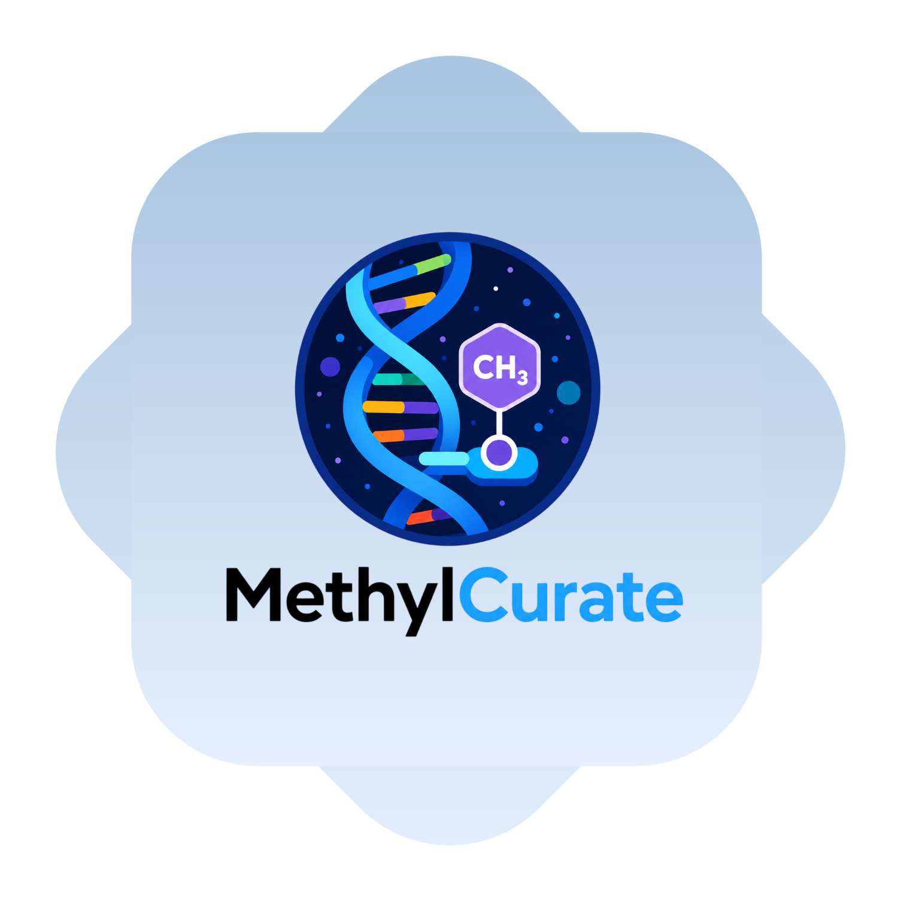
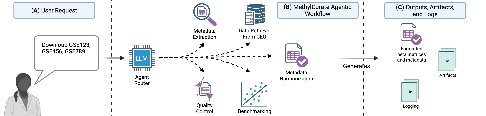

# MethylCurate: DNA Methylation Data Curation and Aging Clock Evaluation

<p align="center">
  <a href="#"></a>
  <a href="https://github.com/langchain-ai/langgraph"></a>
  <a href="#"></a>
  <a href="#"></a>
  <br>
  <a href="#"></a>
  <a href="#"></a>
  <a href="#"></a>
  <a href="#"></a>
</p>

<p align="center">
  
</p>

MethylCurate is an agentic-AI tool for retrieving GEO DNA methylation datasets, harmonizing metadata, constructing standardized beta matrices, and benchmarking epigenetic aging clocks.

## Overview

MethylCurate is an agentic-AI framework for curating public DNA methylation (DNAm) datasets and evaluating epigenetic aging clocks. The tool streamlines the process of retrieving datasets from NCBI GEO, harmonizing heterogeneous sample metadata, parsing processed DNAm beta matrices, applying quality-control procedures, and benchmarking aging clocks through a unified workflow.

MethylCurate combines deterministic data-processing modules with LLM-assisted agents. Deterministic components handle GEO retrieval, methylation matrix formatting, quality control, M-value to beta-value conversion, and clock evaluation. LLM-assisted agents support difficult curation tasks such as metadata extraction, metadata harmonization, supplementary-file parsing, and dialogue-based workflow routing. The system uses schema-constrained outputs, iterative validation, and provenance tracking to improve reproducibility and reduce hallucination risk.

Through a browser-based, dialogue-driven interface, users can retrieve GEO studies, generate standardized metadata, construct formatted beta matrices, and evaluate multiple epigenetic aging clocks with minimal manual intervention. 



## Key Features

- **Automated GEO dataset retrieval**: Downloads GEO study metadata and supplementary files for DNA methylation datasets.

- **Dialogue-driven workflow**: Provides a browser-based interface that lets users request dataset retrieval, metadata extraction, beta matrix construction, and clock evaluation through natural language.

- **LLM-assisted metadata extraction**: Uses schema-constrained LLM agents to extract sample-level metadata from heterogeneous GEO records.

- **Metadata harmonization**: Standardizes fields such as age, sex, tissue type, disease status, and other study-specific annotations across datasets.

- **Supplementary-file parsing**: Infers the structure of processed DNA methylation files and maps methylation data back to sample metadata.

- **DNA methylation matrix formatting**: Constructs standardized beta matrices suitable for downstream analysis and aging clock evaluation.

- **Quality-control pipeline**: Detects methylation value formats, converts M-values to beta values when needed, and applies sample- and CpG-level filtering.

- **Epigenetic aging clock benchmarking**: Evaluates curated datasets with multiple aging clocks through PyAging.

- **Iterative validation and refinement**: Checks extracted metadata and methylation matrices for missing values, inconsistencies, and formatting issues, then refines extraction strategies when needed.

- **Provenance tracking and artifacts**: Records workflow outputs, intermediate files, and logs to support reproducible analyses.

- **Open-source and extensible**: Designed for researchers who want to curate additional GEO datasets, improve prompts, extend workflows, or integrate new benchmarking modules.

## Getting Started

### (1) Prerequisites
 * **Docker**: Install Docker and ensure the Docker daemon is running.
 * **LLM Configuration File**: Provide a `.yml` file with LLM credentials and parameters. See the LLM Configuration section below for more details.

### (2) Configure LLM

Copy and edit the example LLM configuration file:

```bash
cp llm_config.example.yml llm_config.yml
# Edit llm_config.yml with your provider, model, and credentials
```

API keys can be set directly in the config file or via environment variables. The example config uses `${VAR}` syntax so you can keep secrets out of the file:

```bash
export OPENAI_API_KEY=sk-...
```

See the [LLM Configuration](#llm-configuration) section below for all available parameters.

### (3) Build Docker Image

Download the latest MethylCurate repo and build the Docker image.

```bash
git clone git@github.com:travyse/methylcurate.git
cd methylcurate
docker compose build
docker compose up
```

The `docker compose build` command builds the Docker image, while `docker compose up` runs the image. Each time you want to use the tool, you only need to run `docker compose up`.

All workflow outputs (metadata, beta matrices, clock results, and logs) are saved to the `outputs` Docker volume and can be accessed at `./outputs` on the host.

### (4) Launching Tool

To launch the tool, open your browser of interest and visit [http://localhost:3000](http://localhost:3000) to use the tool.

## Development Setup

The Docker workflow above is recommended for end users. To run MethylCurate locally for development:

**Prerequisites:** Python 3.12+, [uv](https://docs.astral.sh/uv/).

```bash
git clone git@github.com:travyse/methylcurate.git
cd methylcurate
uv sync
```

Common development commands via [just](https://github.com/casey/just):

```bash
just qa          # format, lint, type-check, and test
just test        # run the test suite
just type-check  # run the type checker
```

See [CONTRIBUTING.md](CONTRIBUTING.md) for full contributor guidelines.

## LLM Configuration

The LLM config file allows you to select an LLM model of interest and provide API key and other parameters of interest. We provide an example file `llm_config.example.yml` at the base of MethylCurate's directory.

| Parameter         | Values                                    | Description                                                                                                                                                               |
|-------------------|-------------------------------------------|---------------------------------------------------------------------------------------------------------------------------------------------------------------------------|
| provider          | {openai, azure_openai, anthropic, ollama} | This describes the LLM model provider, must be one of the listed values.                                                                                                  |
| model             | string                                    | This describes the specific LLM model being used.                                                                                                                         |
| api_key           | string                                    | API key for the selected provider.                                                                                                                                        |
| base_url          | URL                                       | Override the base URL for the provider (e.g., proxies, alternative endpoints, or Ollama host). Leave unset to use the default.                                            |
| azure_endpoint    | URL                                       | Your Azure endpoint                                                                                                                                                       |
| azure_deployment  | string                                    | Your Azure deployment                                                                                                                                                     |
| azure_api_version | string                                    | Your Azure API version                                                                                                                                                    |
| temperature       | float                                     | The temperature of the model. Increasing the temperature will make the model answer more creatively.                                                                      |
| top_k             | integer                                   | Limits sampling to the k most probable next tokens at each step. Lower values produce more focused output; higher values increase variety.                                 |
| top_p             | float (0–1)                               | Nucleus sampling: considers only tokens whose cumulative probability reaches p. Lower values make output more focused; higher values allow more diversity.                 |
| timeout_s         | integer                                   | How long to wait until the LLM request times out.                                                                                                                         |
| max_retries       | integer                                   | How many times to retry submitting an LLM message.                                                                                                                        |
| streaming         | true, false                               | When enabled, tokens stream to the chat UI in real time as they are generated. Disable for batch responses.                                                               |
| reasoning         | true, false or omitted                    | Enables extended reasoning/thinking mode on providers that support it (e.g., Anthropic extended thinking). Omit if unsupported.                                           |

## Cite

Citation information forthcoming.

## Contact

For questions, issues, or feedback, please open an issue at [github.com/travyse/methylcurate/issues](https://github.com/travyse/methylcurate/issues).

## Author

methylcurate was created in 2026 by Travyse Anthony Edwards.

Built with [Cookiecutter](https://github.com/cookiecutter/cookiecutter) and the [audreyfeldroy/cookiecutter-pypackage](https://github.com/audreyfeldroy/cookiecutter-pypackage) project template.
