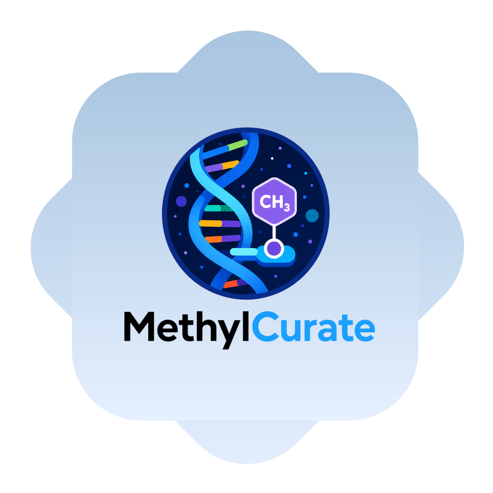
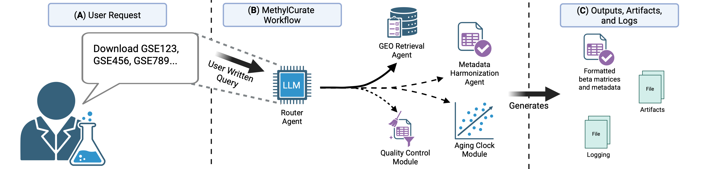

# MethylCurate: DNA Methylation Data Curation and Aging Clock Evaluation

<p align="center">
  <a href="#"></a>
  <a href="https://github.com/langchain-ai/langgraph"></a>
  <a href="#"></a>
  <a href="#"></a>
  <br>
  <a href="#"></a>
  <a href="#"></a>
  <a href="#"></a>
  <a href="#"></a>
</p>

<p align="center">
  
</p>

MethylCurate is an agentic-AI tool for retrieving GEO DNA methylation datasets, harmonizing metadata, constructing standardized beta matrices, and benchmarking epigenetic aging clocks.

## Overview

MethylCurate is an agentic-AI framework for curating public DNA methylation (DNAm) datasets and evaluating epigenetic aging clocks. The tool streamlines the process of retrieving datasets from NCBI GEO, harmonizing heterogeneous sample metadata, parsing processed DNAm beta matrices, applying quality-control procedures, and benchmarking aging clocks through a unified workflow.

MethylCurate combines deterministic data-processing modules with LLM-assisted agents. Deterministic components handle GEO retrieval, methylation matrix formatting, quality control, M-value to beta-value conversion, and clock evaluation. LLM-assisted agents support difficult curation tasks such as metadata extraction, metadata harmonization, supplementary-file parsing, and dialogue-based workflow routing. The system uses schema-constrained outputs, iterative validation, and provenance tracking to improve reproducibility and reduce hallucination risk.

Through a browser-based, dialogue-driven interface, users can retrieve GEO studies, generate standardized metadata, construct formatted beta matrices, and evaluate multiple epigenetic aging clocks with minimal manual intervention. 



## Documentation

For help with installation or to view some tutorials, please visit our [documentation](https://travyse.github.io/methylcurate/).

## Community

For coding-related queries, feedback, and discussions, please visit our [GitHub Issues](https://github.com/Travyse/methylcurate/issues) page.

## Cite

To cite MethylCurate, please use the following:

```
@article{Edwards2026MethylCurate,
	author = {Edwards, Travyse A and Long, Qi and Shen, Li},
	journal = {bioRxiv},
	doi = {10.64898/2026.05.11.723515},
	year = {2026},
	month = {may 14},
	publisher = {openRxiv},
	title = {MethylCurate: Tool for {Dataset} {Curation} and {Epigenetic} {Aging} {Clock} {Evaluation}},
	url = {http://dx.doi.org/10.64898/2026.05.11.723515},
}
```

## Contact

For questions, issues, or feedback, please open an issue at [github.com/travyse/methylcurate/issues](https://github.com/travyse/methylcurate/issues).

## Author

methylcurate was created in 2026 by Travyse Anthony Edwards.

Built with [Cookiecutter](https://github.com/cookiecutter/cookiecutter) and the [audreyfeldroy/cookiecutter-pypackage](https://github.com/audreyfeldroy/cookiecutter-pypackage) project template.
