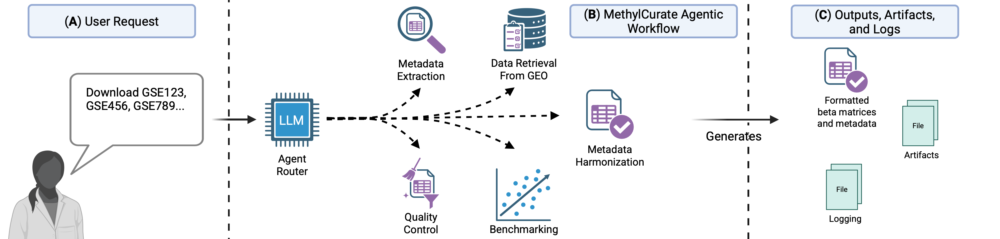

# Welcome to the Documentation for MethylCurate

MethylCurate is an agentic-AI tool for retrieving GEO DNA methylation datasets, harmonizing metadata, constructing standardized beta matrices, and benchmarking epigenetic aging clocks.

## Explore our GitHub Repository

Look into our implementation and contribute to the project on [GitHub](https://github.com/Travyse/methylcurate)

## Contents

## Getting Started
- [Installation](getting-started/installation.md)
- [LLM Configuration](getting-started/llms.md)

## Tutorials
- [Retrieval of DNA Methylation Datasets](tutorials/data-retrieval.md)
- [Dataset Metadata Harmonization](tutorials/data-harmonization.md)
- [Dataset Quality Control](tutorials/data-quality-control.md)
- [Pre-existing Aging Clock Usage](tutorials/aging-clock-usage.md)
- [Debugging](tutorials/debugging.md)
- [Reproduce Blood and Brain Dataset Evaluation](tutorials/reproduce.md)

## API Reference
- [Methylcurate package](api.md)